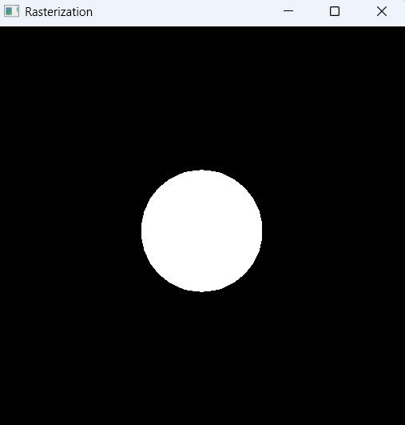

# 🧱 Rasterization Assignment (HW5)

A simple triangle rasterizer implemented in C++ using OpenGL and GLFW.  
The program renders an unshaded sphere composed of triangles using a custom rasterization pipeline.

---

## ✅ Description

This project demonstrates a basic rasterization pipeline without hardware acceleration.  
A unit sphere is generated and transformed to screen space, then rasterized manually with a depth buffer.

---

## 🛠️ Compilation & Run Instructions

1. Open `OpengViewer.sln` in **Visual Studio 2019** or later.
2. Build the solution (`Ctrl + Shift + B`)
3. Run the project (`F5`)
4. Ensure the following dependencies are properly linked and included:
   - **GLEW**
   - **GLFW**
   - **GLM**

---

## 📦 Requirements

- Visual Studio 2019 or later
- GLEW
- GLFW
- GLM

---

## 🖼️ Output

| Result Image |
|--------------|
|  |

---

## 🧠 Implemented Features

| 항목 | 내용 |
|------|------|
| Q1   | 사용자 정의 변환 파이프라인 (모델링 → 투시 → 뷰포트) |
|      | 바운딩 박스 + 바리센트릭 기반 삼각형 래스터라이저 |
|      | Z-buffer를 통한 픽셀 깊이 비교 및 갱신 |
|      | 단일 색상(unshaded white) 픽셀 출력 |

---

